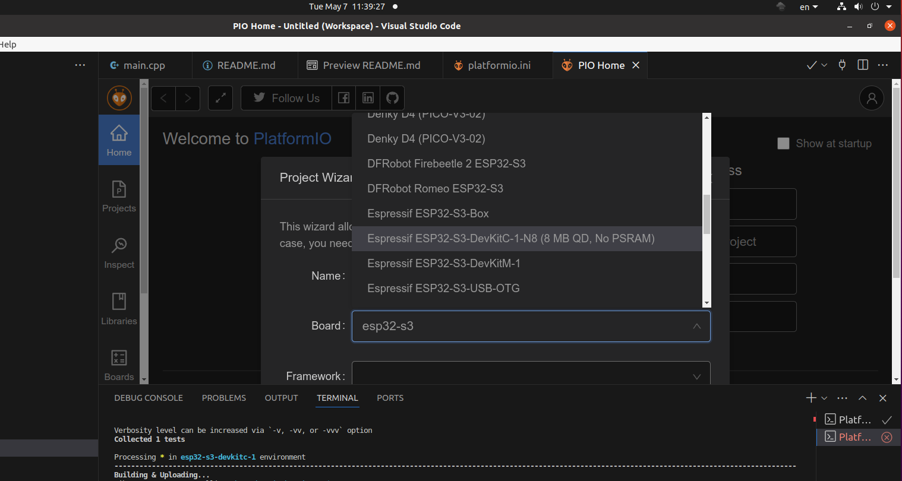
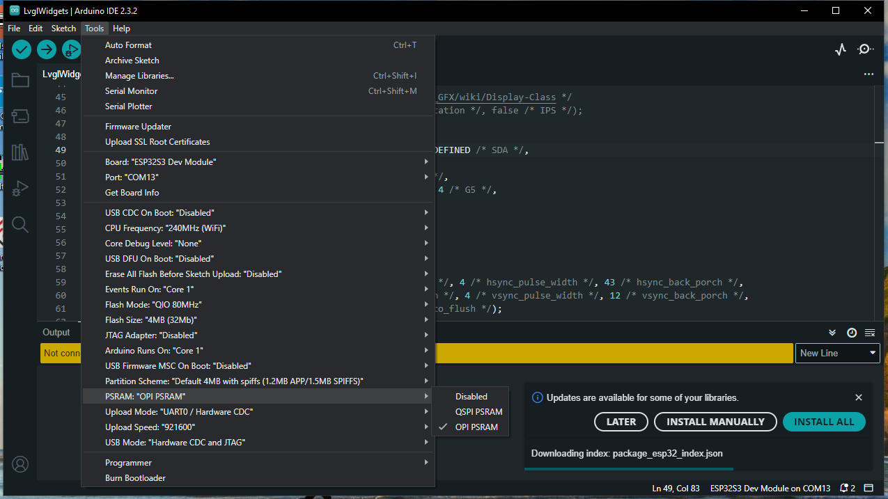

# Introduction

<p align="center"></p>

Recently I bought a couple of [Cheap Yellow Displays](https://github.com/witnessmenow/ESP32-Cheap-Yellow-Display). They were both based on SPI controlled graphics chips and well covered by the [TFT_eSPI](https://github.com/Bodmer/TFT_eSPI) and [Widgets](https://github.com/Bodmer/TFT_eWidget.git) libraries.  
The first 2 boards were 2.8" and 3.2" so I bought another, 4.3" [board](https://www.aliexpress.com/item/1005004788147691.html?spm=a2g0o.order_list.order_list_main.11.54531802TOrJoA), thinking it would be the same as before, just larger.  
As I soon discovered the [ESP32-4827S043](https://www.openhasp.com/0.7.0/hardware/sunton/esp32-4827s043) is quite a different beast. While a serial interface like SPI may give reasonable performance for a small screen it can be a bottle-neck for larger screens, with more data to shift. Accordingly the ESP32-4827S043 uses a parallel interface with faster throughput. Sadly it is not supported by TFT_eSPI so we need a different solution.  
[Arduino_GFX](https://github.com/moononournation/Arduino_GFX) does support the ESP32 parallel interface and is used to control the hardware, [lvgl](https://github.com/lvgl/lvgl) for screen control, widgets and other goodies.  
<b>This is NOT a comparison of the two solutions. They both do an excellent job but in different ways</b>.  
NOTE: Do not confuse Arduino_GFX and Adafruit_GFX. Googling the former often brings up results for the latter.  They both have similar objectives but Adafruit, as far as I can see, does not support the ESP32 16 bit parallel interface of the ESP32-4827S043.  

## Objective
To quickly get up and running with the ESP32-4827S043.  
This is NOT a tutorial for Arduino_GFX and lvgl.
## Caveat
The AliExpress page from which I bought my board has a link to download a bundle of documentation, library and examples source code. I strongly advise you NOT to use the Arduino_GFX and lvgl libraries there as they are older versions (GFX 1.2.8 LVGL 8.3) incompatible with the current versions (GFX 1.4.6 LVGL  9.1 at time of writing).  

## Development
My development environment is VS Code/PlatformIO so this documentation is aimed at that audience.
### Board
In PlatformIO choose the ESP32-S3-DevkitC board.  
<p align="center"></p>
In Arduino IDE choose ESP32S3 Dev Module. Note I also selected OSI PSRAM. Not needed for this example but used in the LVGL example.
<p align="center"></p>

### Libraries
Define the libraries to be loaded in platformIO.ini/lib_deps
```
[env:esp32-s3-devkitc-1]
platform = espressif32
board = esp32-s3-devkitc-1
framework = arduino
lib_deps = 	moononournation/GFX Library for Arduino@^1.4.6
```
# Examples
## HelloWorldNoLVGL
Demonstrates how to install the Arduino_GFX library and define the ESP32-4827S043 device.  
The screen color is set and some text written in the center of the screen,
## TouchNoLVGL

<video width="640" height="480" controls>
  <source src="Images/IMG_0182.mp4" type="video/mp4">
</video>

An extension of the <b>HelloWorldNoLVGL</b> example. The touch screen is defined and polled regularily. If a touch event is detected then a red circle is drawn at that point.  
My board has the capacative touch screen powered by the GT911 controller so the comments below are only relevant to that device. If you have the resistive touch version of the board, feel free to update this document.  
Modifiy platformio.ini to install the GT911 library.  
```
[env:esp32-s3-devkitc-1]
platform = espressif32
board = esp32-s3-devkitc-1
framework = arduino
monitor_speed = 115200
lib_deps = 	moononournation/GFX Library for Arduino@^1.4.6
	tamctec/TAMC_GT911@^1.0.2
```

Note that we have to define the rotations of the screen and touch separately. Unfortunately because of the way they are wired the 2 components do not use the same values for rotation. See the following table.  
Assuming that Normal Landscape mode is with the USB port to the left, normal portrait USB port below.
| Orientation | Screen | Touch |
| ----------- | ------ | ----- |
| Landscape | 0 | 1 ROTATION_INVERTED |
| Portrait | 1 | 2 ROTATION RIGHT |
| Inverted Landscape | 2 | 3 ROTATION_NORMAL |
| Inverted Portrait | 3 | 0 ROTATION LEFT |
<p>
Note that the width and height of the touch screen is defined in the constructor according to the declared orientation. The GT911 library does not handle dynamic rotation change.
<p>
A convenient way to set touch orientation directly from screen orientation is

```
gfx->setRotation(2);
ts.setRotation((gfx->getRotation()+1)%4);
```
## lvglWidget
lvgl needs a lot of RAM. While a smaller screen e.g. 320x240 might be handled within the confines of the 512KB of an ESP32 our larger 480x272 screen cannot. The ESP32-4827S043 has 8MB of PSRAM that needs to be unlocked. The 2 items in *build_flags* relating to PSRAM and the *board_build* line must be entered as-is to platformio.ini to make use of PSRAM.  
lvgl also needs a configuration file *lv_conf.h* to know which of the many options to include and which to omit. The location of the configuration file is the object of much confusion. Each lvgl project may need its own, different, configuration file. To make life simple, place *lv_conf.h* in the *include* folder of the project and add the *-Iinclude/* item to *build_flags*. Don't forget the trailing slash.
```
[env:esp32-s3-devkitc-1]
platform = espressif32
board = esp32-s3-devkitc-1
framework = arduino
monitor_speed = 115200
lib_deps = 	moononournation/GFX Library for Arduino@^1.4.6
	lvgl/lvgl@^9.1.0
	tamctec/TAMC_GT911@^1.0.2
build_flags = -Iinclude/
    -DBOARD_HAS_PSRAM -mfix-esp32-psram-cache-issue
board_build.arduino.memory_type = qio_opi
```
## lvglButtonExample
<video width="640" height="480" controls>
  <source src="Images/IMG_0190.mp4" type="video/mp4">
</video>

This is an implementation of the *lv_example_button_1* example from the lvgl examples library. Library installation and PSRAM unlocking is as shown in the previous example.
## lvglFileSystem
lvgl has an abstraction of a file system that interfaces to a physical file system via callback functions.  
I have implemented a library that provides file I/O (open/close/read/write/seek/tell) and directory(open/read/close) for SD devices. Using my code it should be easy to repeat for another physical device e.g. LittleFS.  
My source only allows for a single file/directory to be open at any point in time.  
My sources are in the lib/FileSystem folder.  
The directory listing example raises and interesting point. lvgl has no way to identify a file as a directory, so how can one do a recursive directory listing? I prepend directory name by DIR:.  
Note that I did NOT define a logical drive in the *lv_conf.h* file. It is defined in my library source and I arbitarily assigned the letter 'S' to SD device.
